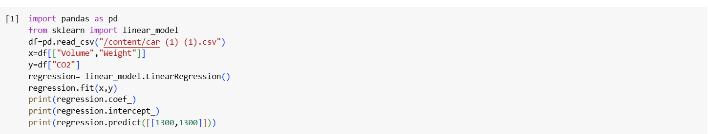

# Implementation of Multivariate Linear Regression
## Aim
To write a python program to implement multivariate linear regression and predict the output.
## Equipment’s required:
1.	Hardware – PCs
2.	Anaconda – Python 3.7 Installation / Moodle-Code Runner
## Algorithm:
Step 1: Import the necessary libraries.
Step 2: Load the dataset using pandas.read_csv().

Step 3: Extract the independent variables (features) — in this case, "Volume" and "Weight" — and assign them to variable x.

Step 4: Extract the dependent variable (target), "CO2", and assign it to variable y.

Step 5: Create a Linear Regression model using LinearRegression().

Step 6: Train the model using the .fit(x, y) method to establish a relationship between features and target.

Step 7: Display the coefficients (slopes for each feature) using .coef_ and the intercept using .intercept_.

Step 8: Predict the CO2 emission for a given input (e.g., Volume = 1300, Weight = 1300) using .predict().

Step 9: End the program.

## Program:
```
import pandas as pd
from sklearn import linear_model
df=pd.read_csv("/content/car (1) (1).csv")
x=df[["Volume","Weight"]]
y=df["CO2"]
regression= linear_model.LinearRegression()
regression.fit(x,y)
print(regression.coef_)
print(regression.intercept_)
print(regression.predict([[1300,1300]]))

```
## Output:


### Insert your output


## Result
Thus the multivariate linear regression is implemented and predicted the output using python program.